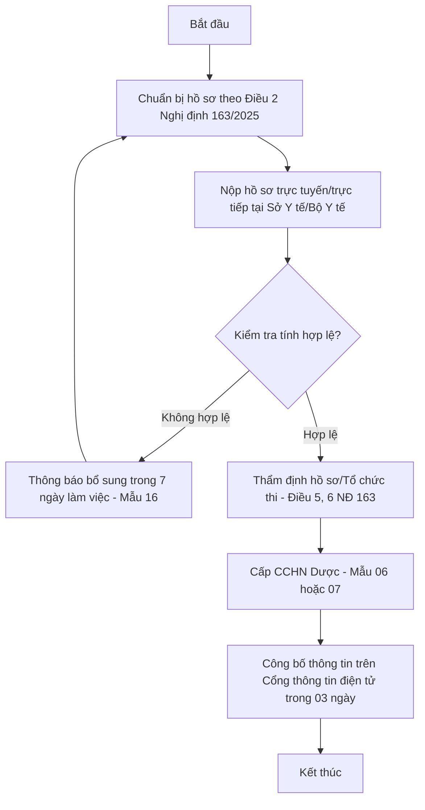
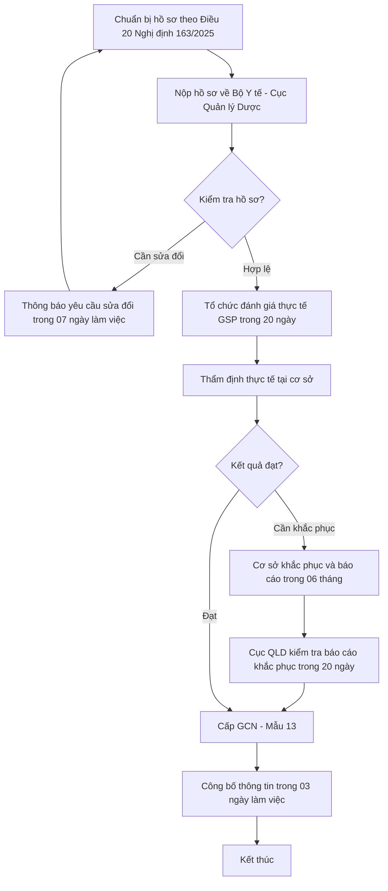

# BÁO CÁO NGHIÊN CỨU PHÁP LUẬT VIỆT NAM TRONG LĨNH VỰC DƯỢC PHẨM

**Đề tài:** “Quy định về chứng chỉ hành nghề đối với người chịu trách nhiệm chuyên môn về dược, giấy chứng nhận đủ điều kiện kinh doanh đối với cơ sở xuất khẩu, nhập khẩu thuốc, nguyên liệu làm thuốc”

---

## Mẫu 01: Bìa ngoài

**TRƯỜNG ĐẠI HỌC [Tên trường]**  
**KHOA DƯỢC / KHOA LUẬT**  

 
 

### BÁO CÁO NGHIÊN CỨU CHÍNH SÁCH VÀ PHÁP LUẬT

**ĐỀ TÀI:**  
**QUY ĐỊNH VỀ CHỨNG CHỈ HÀNH NGHỀ ĐỐI VỚI NGƯỜI CHỊU TRÁCH NHIỆM CHUYÊN MÔN VỀ DƯỢC, GIẤY CHỨNG NHẬN ĐỦ ĐIỀU KIỆN KINH DOANH ĐỐI VỚI CƠ SỞ XUẤT KHẨU, NHẬP KHẨU THUỐC, NGUYÊN LIỆU LÀM THUỐC**

 
 

**Nhóm thực hiện:** [Tên Nhóm/Lớp]  
**Giảng viên hướng dẫn:** [Tên Giảng viên]  

**Thành phố Hồ Chí Minh / Hà Nội, Tháng 12 năm 2025**

---

## Mẫu 02: Danh sách sinh viên trong nhóm

| STT | Họ và Tên | Mã số sinh viên | Lớp | Ghi chú |
|:---:|:---|:---:|:---:|:---|
| 1 | [Họ tên SV 1] | [MSSV 1] | [Lớp] | Nhóm trưởng |
| 2 | [Họ tên SV 2] | [MSSV 2] | [Lớp] | Thành viên |
| 3 | [Họ tên SV 3] | [MSSV 3] | [Lớp] | Thành viên |
| 4 | [Họ tên SV 4] | [MSSV 4] | [Lớp] | Thành viên |

---

## Mẫu 03: Phân công công việc

| STT | Nội dung công việc | Người thực hiện | Thời gian | Kết quả |
|:---:|:---|:---|:---:|:---|
| 1 | Nghiên cứu Luật Dược 2016 và Luật 44/2024 | [Tên SV 1] | Tuần 1 | Hoàn thành |
| 2 | Tổng hợp Nghị định 163/2025 và Thông tư | [Tên SV 2] | Tuần 1 | Hoàn thành |
| 3 | Xây dựng quy trình, sơ đồ thủ tục | [Tên SV 3] | Tuần 2 | Hoàn thành |
| 4 | Tổng hợp, biên tập báo cáo hoàn chỉnh | [Tên SV 1, 4] | Tuần 2 | Hoàn thành |

---

## DANH MỤC CÁC KÝ HIỆU VÀ CHỮ VIẾT TẮT

- **BYT:** Bộ Y tể
- **CCHN:** Chứng chỉ hành nghề
- **GCN ĐĐK KDD:** Giấy chứng nhận đủ điều kiện kinh doanh dược
- **GSP:** Thực hành tốt bảo quản thuốc (Good Storage Practices)
- **QLD:** Quản lý Dược (hoặc Cục Quản lý Dược - DAV)
- **TTHC:** Thủ tục hành chính
- **XNK:** Xuất khẩu, nhập khẩu

---

## MỤC LỤC

1. [ĐẶT VẤN ĐỀ](#đặt-vấn-đề)
2. [CHƯƠNG 1. TỔNG HỢP QUY PHẠM PHÁP LUẬT](#chương-1-tổng-hợp-quy-phạm-pháp-luật)
   - 1.1. Danh mục văn bản quy phạm pháp luật có liên quan
   - 1.2. Nội dung các quy phạm pháp luật
3. [CHƯƠNG 2. XÂY DỰNG QUY TRÌNH THỰC HIỆN THỦ TỤC](#chương-2-xây-dựng-quy-trình-thực-hiện-thủ-tục)
   - 2.1. Thủ tục đề nghị cấp Chứng chỉ hành nghề dược
   - 2.2. Thủ tục đề nghị cấp Giấy chứng nhận đủ điều kiện kinh doanh dược (XNK)
4. [KẾT LUẬN](#kết-luận)
5. [TÀI LIỆU THAM KHẢO](#tài-liệu-tham-khảo)

---

## ĐẶT VẤN ĐỀ

**Tầm quan trọng và ý nghĩa của đề tài:**  
Trong bối cảnh hội nhập kinh tế quốc tế sâu rộng, hoạt động xuất nhập khẩu thuốc và nguyên liệu làm thuốc đóng vai trò huyết mạch trong việc đảm bảo an ninh thuốc quốc gia. Do tính chất đặc thù liên quan trực tiếp đến sức khỏe và tính mạng con người, Nhà nước Việt Nam thiết lập một hành lang pháp lý cực kỳ chặt chẽ nhằm kiểm soát năng lực chuyên môn của cá nhân và điều kiện vật chất của tổ chức tham gia vào chuỗi cung ứng này.

**Lý do chọn đề tài:**  
Năm 2025 đánh dấu bước ngoặt lớn với việc thực thi Luật sửa đổi, bổ sung một số điều của Luật Dược (Luật số 44/2024/QH15) và Nghị định 163/2025/NĐ-CP. Theo phân tích của nhóm, việc nghiên cứu các quy định về Chứng chỉ hành nghề (CCHN) và Giấy chứng nhận đủ điều kiện kinh doanh dược (GCN ĐĐK KDD) trong giai đoạn mới này là vô cùng cấp thiết để các doanh nghiệp và dược sĩ nắm bắt kịp thời các quy định mới nhất, tránh sai sót trong quá trình tuân thủ pháp luật.

**Mục tiêu nghiên cứu:**  
- Hệ thống hóa khung pháp lý mới nhất áp dụng cho hoạt động XNK dược phẩm năm 2025.
- Làm rõ các điều kiện về nhân sự chuyên trách và cơ sở vật chất đối với cơ sở XNK.
- Xây dựng quy trình thủ tục hành chính khoa học theo mô hình mới của Bộ Y tế.

**Phạm vi nghiên cứu:**  
Quy định pháp luật hiện hành của Việt Nam đối với cá nhân chịu trách nhiệm chuyên môn và các cơ sở kinh doanh dược thuộc loại hình xuất khẩu, nhập khẩu thuốc, nguyên liệu làm thuốc.

---

## CHƯƠNG 1. TỔNG HỢP QUY PHẠM PHÁP LUẬT

### 1.1. Danh mục văn bản quy phạm pháp luật có liên quan

| STT | Số, ký hiệu | Tên văn bản | Ngày ban hành | Cơ quan ban hành | Ngày hiệu lực | Phạm vi & Đối tượng |
|:---:|:---|:---|:---:|:---:|:---:|:---|
| 1 | 39/VBHN-VPQH | Văn bản hợp nhất Luật Dược (Hợp nhất Luật 2016, 28/2018 và 44/2024) | 27/02/2025 | Văn phòng Quốc hội | 01/07/2025 | Quy định về chính sách, hành nghề, kinh doanh dược... |
| 2 | 163/2025/NĐ-CP | Nghị định quy định chi tiết một số điều và biện pháp để tổ chức, hướng dẫn thi hành Luật Dược | 29/06/2025 | Chính phủ | 01/07/2025 | Hướng dẫn CCHN, ĐĐKKD, XNK, GSP... |
| 3 | 31/2025/TT-BYT | Thông tư quy định về Chứng chỉ hành nghề dược | 2025 | Bộ Y tế | 01/07/2025 | Quy định về hồ sơ, thủ tục cấp CCHN dược |
| 4 | 11/2025/TT-BYT | Thông tư về GCN ĐĐK KDD và tiêu chuẩn Thực hành tốt (GSP) | 2025 | Bộ Y tế | 2025 | Quy định điều kiện kho tàng, thẩm định GSP |

### 1.2. Nội dung các quy phạm pháp luật

#### 1.2.1. Quy định về Chứng chỉ hành nghề dược (Lĩnh vực XNK)
> [!NOTE]
> Nội dung này áp dụng đối với **cá nhân** có nguyện vọng hành nghề dược tại các vị trí chuyên môn quy định tại Luật Dược.

Căn cứ theo **Văn bản hợp nhất 39/VBHN-VPQH** (Điều 17) và **Nghị định 163/2025/NĐ-CP** (Chương II), nhóm tổng hợp các quy định trọng tâm như sau:

- **Vị trí bắt buộc (Điều 11 Luật Dược):** Người chịu trách nhiệm chuyên môn về dược của cơ sở kinh doanh dược.
- **Điều kiện văn bằng (Điều 17 Luật Dược):** Người chịu trách nhiệm chuyên môn của cơ sở XNK thuốc, nguyên liệu làm thuốc phải có bằng tốt nghiệp đại học ngành Dược (Dược sĩ đại học). Riêng đối với vắc xin, sinh phẩm có thể sử dụng bằng đại học ngành Y đa khoa hoặc Sinh học (khoản 2 Điều 17).
- **Thời gian thực hành (Điều 17 Luật Dược):** Yêu cầu có ít nhất **02 năm (24 tháng)** thực hành chuyên môn tại cơ sở dược phù hợp.
- **Giảm thời gian thực hành (Điều 15 Nghị định 163/2025):** Theo đánh giá của nhóm, quy định mới tạo điều kiện thuận lợi cho nhân sự trình độ cao khi cho phép giảm 3/4 thời gian đối với Tiến sĩ/CKII và giảm 1/2 thời gian đối với Thạc sĩ/CKI.

#### 1.2.2. Quy định về Giấy chứng nhận ĐĐK KDD (Cơ sở XNK)
> [!NOTE]
> Nội dung này áp dụng đối với **tổ chức/cơ sở** thực hiện hoạt động kinh doanh xuất khẩu, nhập khẩu thuốc, nguyên liệu làm thuốc.

Căn cứ theo **Văn bản hợp nhất 39/VBHN-VPQH** (Điều 33) và **Nghị định 163/2025/NĐ-CP** (Mục 1 Chương III), nhóm nhận thấy các yêu cầu sau là bắt buộc:

- **Điều kiện nhân sự (Điều 33 Luật Dược):** Người chịu trách nhiệm chuyên môn phải có CCHN dược phù hợp.
- **Điều kiện cơ sở vật chất (Điều 33 Luật Dược):** Phải có địa điểm, kho bảo quản thuốc, trang thiết bị, hệ thống quản lý chất lượng đáp ứng **GSP** (Thực hành tốt bảo quản thuốc).
- **Biện pháp an ninh (Điều 31 Nghị định 163/2025):** Đối với thuốc kiểm soát đặc biệt, nhóm nhấn mạnh yêu cầu phải có kho/khu vực riêng có khóa chắc chắn, hệ thống camera theo dõi và hồ sơ sổ sách theo dõi nghiêm ngặt.
- **Điều kiện nhân sự kho (Điều 32 Nghị định 163/2025):** Thủ kho bảo quản thuốc gây nghiện phải là Dược sĩ đại học có 12 tháng thực hành chuyên môn.

---

## CHƯƠNG 2. XÂY DỰNG QUY TRÌNH THỰC HIỆN THỦ TỤC

### 2.1. Thủ tục đề nghị cấp Chứng chỉ hành nghề dược

#### 2.1.1. Sơ đồ quy trình thực hiện

**Bảng 1: Căn cứ pháp lý quy trình cấp CCHN dược**

| Bước | Nội dung thực hiện | Căn cứ pháp lý |
|:---:|:---|:---|
| 1 | Chuẩn bị hồ sơ đề nghị cấp CCHN | Điều 2 Nghị định 163/2025/NĐ-CP |
| 2 | Nộp hồ sơ và tiếp nhận | Điều 6 Nghị định 163/2025/NĐ-CP |
| 3 | Thẩm định hồ sơ / Tổ chức thi | Điều 5, 6 Nghị định 163/2025/NĐ-CP |
| 4 | Cấp Chứng chỉ hành nghề dược | Điều 8 Nghị định 163/2025/NĐ-CP |
| 5 | Công bố thông tin CCHN | Điều 9 Nghị định 163/2025/NĐ-CP |

#### 2.1.2. Mô tả chi tiết từng bước
- **Bước 1: Chuẩn bị hồ sơ (Điều 2 Nghị định 163/2025).** Theo phân tích của nhóm, hồ sơ bao gồm: Đơn (Mẫu 02); Giấy xác nhận thời gian thực hành (Mẫu 03); Giấy khám sức khỏe; Bản sao văn bằng chuyên môn.
- **Bước 2: Nộp hồ sơ (Điều 6 Nghị định 163/2025).** Nộp về Sở Y tế (đối với xét hồ sơ) hoặc Bộ Y tế (đối với thi).
- **Bước 3: Tiếp nhận và xử lý.** Nhóm nhận thấy thời hạn cấp là 20 ngày (xét hồ sơ) hoặc 15 ngày (thi - theo Luật). Nghị định 163 quy định chi tiết lịch trình thi và trả kết quả.

### 2.2. Thủ tục đề nghị cấp Giấy chứng nhận ĐĐK KDD (XNK)

#### 2.2.1. Sơ đồ quy trình thực hiện

**Bảng 2: Căn cứ pháp lý quy trình cấp GCN ĐĐK KDD (XNK)**

| Bước | Nội dung thực hiện | Căn cứ pháp lý |
|:---:|:---|:---|
| 1 | Chuẩn bị hồ sơ đề nghị cấp GCN | Điều 20 Nghị định 163/2025/NĐ-CP |
| 2 | Nộp hồ sơ tại Cục Quản lý Dược | Điều 21 Nghị định 163/2025/NĐ-CP |
| 3 | Kiểm tra và thẩm định hồ sơ | Điều 21 Nghị định 163/2025/NĐ-CP |
| 4 | Đánh giá thực tế điều kiện (GSP) | Điều 21; Điều 31, 32 Nghị định 163/2025/NĐ-CP |
| 5 | Cấp GCN đủ điều kiện kinh doanh dược | Điều 21 Nghị định 163/2025/NĐ-CP |

#### 2.2.2. Mô tả chi tiết từng bước
- **Bước 1: Chuẩn bị hồ sơ (Điều 20 Nghị định 163/2025).** Bao gồm Đơn (Mẫu 10/11/12); Tài liệu kỹ thuật tương ứng với Thực hành tốt bảo quản thuốc (GSP).
- **Bước 2: Nộp hồ sơ (Điều 21 Nghị định 163/2025).** Cơ sở XNK nộp hồ sơ về Bộ Y tế. Nhóm lưu ý việc nộp hồ sơ có thể thực hiện thông qua hệ thống dịch vụ công trực tuyến.
- **Bước 3: Đánh giá thực tế.** Cục Quản lý Dược tổ chức đánh giá trong vòng 20 ngày kể từ ngày nhận đủ hồ sơ.
- **Bước 4: Cấp GCN (Điều 21 Nghị định 163/2025).** Trong 10 ngày kể từ khi kết thúc đánh giá thực tế (không có yêu cầu khắc phục). Mẫu GCN là Mẫu số 13 Phụ lục I.

---

## KẾT LUẬN

Báo cáo đã cập nhật chi tiết các quy định từ **Văn bản hợp nhất 39/VBHN-VPQH** và **Nghị định 163/2025/NĐ-CP**. Theo đánh giá của nhóm, các thay đổi chủ yếu tập trung vào việc chuẩn hóa hồ sơ (sử dụng các Mẫu biểu mới từ Phụ lục I Nghị định 163), siết chặt các biện pháp an ninh đối với thuốc kiểm soát đặc biệt và tối ưu hóa thời gian thực hành chuyên môn cho người có trình độ cao.

Thông qua việc thực hiện báo cáo này, nhóm đã có cơ hội tiếp cận sâu hơn với các văn bản quy phạm pháp luật mới nhất, từ đó rèn luyện kỹ năng phân tích và hệ thống hóa quy định pháp luật. Nhóm nhận thấy rằng việc hiểu đúng và vận dụng chính xác các quy định về Chứng chỉ hành nghề và Giấy chứng nhận đủ điều kiện kinh doanh dược không chỉ là yêu cầu bắt buộc về mặt pháp lý mà còn có ý nghĩa thực tiễn quan trọng, giúp đảm bảo tính an toàn, hiệu quả trong chuỗi cung ứng thuốc và nâng cao trách nhiệm của người dược sĩ trong quản lý nhà nước về dược.

---

## TÀI LIỆU THAM KHẢO

### A. Văn bản quy phạm pháp luật
1. **Văn phòng Quốc hội (2025).** *Văn bản hợp nhất số 39/VBHN-VPQH ngày 27/02/2025 hợp nhất Luật Dược.*
2. **Chính phủ Việt Nam (2025).** *Nghị định số 163/2025/NĐ-CP ngày 29/06/2025 quy định chi tiết một số điều và biện pháp để tổ chức, hướng dẫn thi hành Luật Dược.*
3. **Bộ Y tế (2025).** *Thông tư số 31/2025/TT-BYT quy định về cấp Chứng chỉ hành nghề dược.*
4. **Bộ Y tế (2025).** *Thông tư số 11/2025/TT-BYT quy định về điều kiện kinh doanh dược và Thực hành tốt bảo quản thuốc (GSP).*

### B. Nguồn chính thống của cơ quan nhà nước
5. **Cục Quản lý Dược - Bộ Y tế.** *Cổng thông tin điện tử.* Truy cập tại: https://dav.gov.vn
6. **Văn phòng Chính phủ.** *Cổng Dịch vụ công Quốc gia.* Truy cập tại: https://dichvucong.gov.vn

### C. Nguồn tham khảo hỗ trợ
7. Hệ thống Cơ sở dữ liệu quốc gia về văn bản quy phạm pháp luật.
8. Các giáo trình và tài liệu hướng dẫn về Pháp chế Dược tại các cơ sở đào tạo.
